# *You're strong... but I don't stop leveling up.*

 

 

  

## 👋 About

Computer scientist (informático). I like going from the metal up: Windows internals and native APIs on one side, 3D on the web on the other, and tying it together with automation. I ship things I actually use.

Building in public since **~2 months ago** — a couple of real projects up so far, more coming as they're ready for other people to see.

## 🛠️ Projects

| | |
|---|---|
| **[Sothe Windows Optimizer](https://github.com/ImSothe/Sothe-Windows-Optimizer)** | A power-user Windows tuning tool: 70+ reversible tweaks, nothing hidden behind a "safe mode." WPF/.NET 8, `ntdll` P/Invoke for timer resolution, an ECDSA-signed auto-updater, and 212 automated tests. |
| **[Industrial Web Template](https://github.com/ImSothe/Industrial-Web-Template)** | A sanitized, portfolio-ready B2B 3D configurator (Three.js + GSAP + polygon-clipping) distilled from a real industrial project, with a hardened reference API (parameterized SQL, XSS/path-traversal defenses, lockout policy). |

## 📊 GitHub stats

## 📬 Contact

Instagram **[@SoySothe](https://www.instagram.com/soysothe)** · Email **angelbazm@gmail.com**

